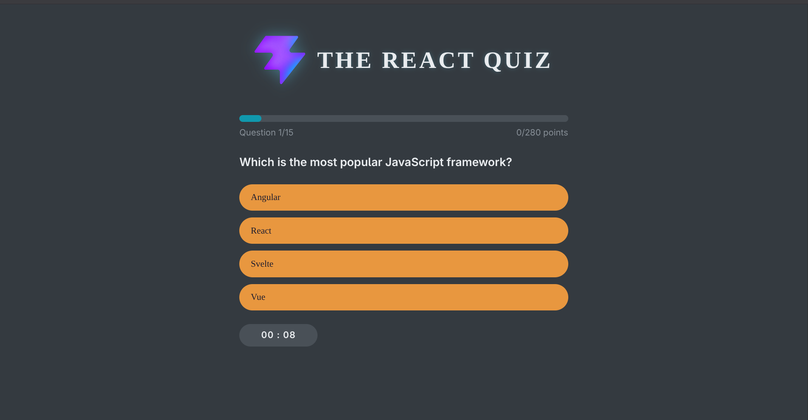

# ⚛️ The React Quiz

A timed quiz app built with React to test your React knowledge — 15 questions, a countdown timer, and a live scoring system. Built as a hands-on learning project to get deeper into React hooks, state management, and component architecture.

---

## ✨ Features

- **15 React questions** fetched from a local JSON Server API
- **2-minute countdown timer** that auto-ends the quiz when it hits zero
- **Live progress bar** that updates as you move through questions
- **Point system** where each question carries different points, tracked in real time
- **Answer reveal** after selection with correct/wrong indicators (✅ ❌)
- **Two result screens** — one for quiz completion, one for when time runs out
- **Dark-themed UI** with Codystar font, pill-shaped buttons, and hover animations

---

## 🛠️ Tech Stack

| Tech | Purpose |
|------|---------|
| **React 19** | UI components & state management |
| **Vite 8** | Dev server & build tool |
| **JSON Server** | Mock REST API for quiz questions |
| **Vanilla CSS** | Custom dark theme with animations |

---

##  What I Learned Building This

**useEffect** — How to fetch data on mount, how cleanup functions work with timers, and why you can't pass an async function directly as the effect callback.

**useReducer vs useState** — I started with multiple `useState` calls for question index, options, score, and question number. It got messy fast. Switching to `useReducer` let me manage all of that through a single reducer with clear action types like `"next"` and `"update"`. Way cleaner.

**Timer logic in React** — Building a countdown sounds simple but it's tricky. You need `setInterval` inside `useEffect`, the cleanup function to `clearInterval` on every re-render, and handling the edge case when time hits zero.

**Conditional rendering** — Handling different UI states (welcome → quiz → result → time over) all within one component taught me how to structure complex conditional renders.

---

##  Bugs I Fixed Along the Way

1. **Point system was broken** — I wasn't using the `value` attribute on option buttons. The app had no way to know which option was selected. Added `value={option}` and scoring worked.

2. **Async useEffect** — Passed an `async` function directly as the `useEffect` callback. React expects it to return nothing or a cleanup function, not a Promise. Wrapped the fetch in an inner async function.

3. **Reading empty state on render** — Tried to read `questions[0]` before the API data loaded. State was still an empty array. Added a length check and showed a loading state instead.

4. **Timer cleanup** — Used `removeInterval` instead of `clearInterval` and was calling `setTime` immediately instead of passing a callback to `setInterval`. Both caused the timer to break.

5. **Conditional hook call** — Had an early `return` before `useState` which broke React's rules of hooks. Moved all hooks to the top of the component.

---

##  Screenshots

---

---

*Built while learning React* 
